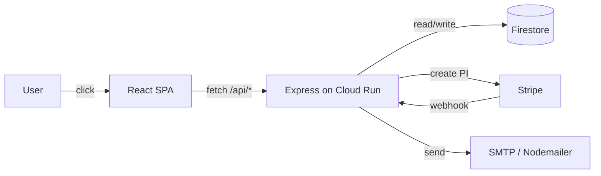

# Phase 0 — Decide & Document Implementation Plan

> **For agentic workers:** REQUIRED SUB-SKILL: Use superpowers:subagent-driven-development (recommended) or superpowers:executing-plans to implement this plan task-by-task. Steps use checkbox (`- [ ]`) syntax for tracking.

**Goal:** Lock in the open infra decisions and produce four authoritative docs (infra-decisions, README, PRD, user-flows) plus archive the dead plans, so every later phase has a single source of truth to build against.

**Architecture:** Documentation-only phase. No production code changes. Each doc is committed in its own commit so the history shows intent. Where a doc makes factual claims about the codebase, the writer must verify the claim against current code before writing the sentence — stale claims are how the existing PRD became wrong.

**Tech Stack:** Plain Markdown. Mermaid for the sequence diagrams in `user-flows.md` (renders on GitHub natively). No build step.

**Reference:** This plan implements `docs/superpowers/specs/2026-05-12-site-hardening-roadmap-design.md` §4 (Phase 0).

---

## File Structure

This plan creates or rewrites the following files. Each has one responsibility; together they form the doc surface every other phase reads from.

| File | Status | Responsibility |
|---|---|---|
| `docs/superpowers/plans/archived/` | New dir | Holding pen for abandoned plans |
| `docs/superpowers/plans/archived/<5 files>` | Moved | The 5 abandoned analytics-funnel plans |
| `docs/superpowers/plans/README.md` | New | Plan-folder index — one line per plan, status tagged |
| `docs/infra-decisions.md` | New | Locked-in choices: error reporting, staging, typecheck, history rewrite, Node, CSP |
| `README.md` | Rewrite | Getting-started + run + deploy + env-vars, accurate to 2026-05-12 |
| `PRD.md` | Rewrite | Product requirements doc reflecting React 19 + Express + Firestore + Stripe + Cloud Run reality |
| `docs/user-flows.md` | New | Sequence diagrams + step-by-step traces of every live customer & admin flow |

Why this order in tasks: archives + plan-index are mechanical (no synthesis); infra-decisions is the ground truth the next docs reference; README is small + tightly bounded; PRD is medium and depends on README's tech-stack section; user-flows is the largest and depends on everything else being right.

**Decision defaults** (taken from the spec, accepted by user 2026-05-12 unless they object during this phase):
- Error reporting: **Sentry**
- Staging: **Separate Firebase project (`hq-aviation-staging`) + separate Cloud Run service + Stripe test mode + `staging.<domain>` host**
- Typecheck: **JSDoc + `checkJs: true`** (no full TS migration)
- `/images` cleanup: **Delete from `main`, no git-history rewrite**
- Node target: **`>=20`**
- CSP policy: **`default-src 'self'`** with explicit allowlist for Stripe, Firebase, Google Fonts

If the user disputes a default during this phase, edit `infra-decisions.md` in-place and commit the revision.

---

## Task 1: Archive abandoned plans

**Files:**
- Create dir: `docs/superpowers/plans/archived/`
- Move: 5 files into `archived/` (see step 2)
- Prepend banner to each moved file (see step 4)

- [ ] **Step 1: Confirm the 5 abandoned analytics plans still exist**

Run: `ls docs/superpowers/plans/2026-04-29-analytics-funnel-phase-1.md docs/superpowers/plans/2026-04-30-analytics-funnel-phase-2.md docs/superpowers/plans/2026-05-01-analytics-funnel-phase-3.md docs/superpowers/plans/2026-05-01-analytics-funnel-phase-4.md docs/superpowers/plans/2026-05-01-analytics-info-tooltips.md`

Expected: all 5 listed without error. If any is missing, list the actual contents of `docs/superpowers/plans/` with `ls docs/superpowers/plans/ | grep analytics` and substitute accordingly.

Audit verification: each file should have no corresponding feature in `src/` — quick check `grep -r "analytics-funnel" src/ api/ server.js | head -5` should return nothing meaningful.

- [ ] **Step 2: Create the archived subdirectory and move the 5 plans**

Run:
```bash
mkdir -p docs/superpowers/plans/archived
git mv docs/superpowers/plans/2026-04-29-analytics-funnel-phase-1.md docs/superpowers/plans/archived/
git mv docs/superpowers/plans/2026-04-30-analytics-funnel-phase-2.md docs/superpowers/plans/archived/
git mv docs/superpowers/plans/2026-05-01-analytics-funnel-phase-3.md docs/superpowers/plans/archived/
git mv docs/superpowers/plans/2026-05-01-analytics-funnel-phase-4.md docs/superpowers/plans/archived/
git mv docs/superpowers/plans/2026-05-01-analytics-info-tooltips.md docs/superpowers/plans/archived/
git status --short
```

Expected: `git status` shows 5 renames `R  docs/superpowers/plans/<file>.md -> docs/superpowers/plans/archived/<file>.md`.

- [ ] **Step 3: Prepend an archive banner to each moved file**

For each of the 5 files, prepend this exact block (using Edit tool with `old_string` = the first heading of the file, `new_string` = banner + first heading):

```markdown
> **ARCHIVED 2026-05-12**
> This plan was abandoned with zero matching code in `src/` or `api/`. Replaced by `docs/superpowers/specs/2026-05-12-site-hardening-roadmap-design.md` §3 (non-goals). Do not implement.

```

Verify by running `head -3 docs/superpowers/plans/archived/2026-04-29-analytics-funnel-phase-1.md` — first line must be the banner.

- [ ] **Step 4: Commit**

```bash
git add docs/superpowers/plans/archived/
git commit -m "$(cat <<'EOF'
docs(plans): archive 5 abandoned analytics-funnel plans

Moves the five analytics-funnel plans (phase 1-4 + info-tooltips, dated
2026-04-29 through 2026-05-01) to docs/superpowers/plans/archived/ with
an archived banner. None had matching code in src/ or api/; superseded
by the site-hardening roadmap (§3 non-goals).

Co-Authored-By: Claude Opus 4.7 <noreply@anthropic.com>
EOF
)"
```

Expected: commit succeeds; `git log --oneline -1` shows the commit message.

---

## Task 2: Write the plan-folder index

**Files:**
- Create: `docs/superpowers/plans/README.md`

- [ ] **Step 1: List the current plans to ground the index**

Run: `ls docs/superpowers/plans/*.md | sort`

This gives the source of truth for what's left after Task 1. Note each filename — the index lists them all.

- [ ] **Step 2: For each plan, determine status from git log**

For each plan file (not the archived ones), run:

```bash
git log --oneline --all -- <plan-file> | head -3
```

Status rules:
- **shipped** — there are merge commits on `main` clearly implementing it, or a clear `feat(...)` commit landing the feature
- **in-flight** — feature branch exists with unmerged commits, or commits are on `main` but plan body shows uncompleted tasks
- **queued** — neither shipped nor active branch; sits as next-to-pick
- **superseded** — replaced by a newer plan (note which)

Be honest, not generous. When in doubt mark **in-flight**.

- [ ] **Step 3: Write `docs/superpowers/plans/README.md`**

Structure:

```markdown
# Plans index

> Source of truth for what work is queued, in-flight, shipped, or archived.
> Update this file when you create a new plan or change a plan's status.
> Updated 2026-05-12.

## Active

Plans being implemented or queued for implementation.

- [`2026-05-12-phase-0-decide-and-document.md`](2026-05-12-phase-0-decide-and-document.md) — **in-flight** — this plan
- [`2026-05-12-image-optimisation-d4.md`](2026-05-12-image-optimisation-d4.md) — **queued** — Lighthouse measurement of D1-D3 wins
- ... <one line per remaining plan>

## Shipped

Plans whose work landed on `main`. Kept for context.

- [`2026-05-11-image-optimisation-d2.md`](2026-05-11-image-optimisation-d2.md) — `<Image>` component + canonical-page rollout
- ... <one line per shipped plan>

## Archived

Plans abandoned without implementation. See `archived/`.

- [`archived/2026-04-29-analytics-funnel-phase-1.md`](archived/2026-04-29-analytics-funnel-phase-1.md) — superseded by site-hardening roadmap
- ... <one line per archived plan>
```

Fill in one entry per file found in Step 1. Each entry: filename link, status tag in bold, ≤80-character description.

- [ ] **Step 4: Verify every plan file in the directory is listed exactly once**

Run:
```bash
# Files in plans/ (top-level only)
ls docs/superpowers/plans/*.md | grep -v README.md | wc -l
# Entries linked from README.md
grep -c -E '^\- \[`docs/superpowers/plans/' docs/superpowers/plans/README.md || \
grep -c -E '^\- \[`2026-' docs/superpowers/plans/README.md
```

The two numbers must match (modulo the README itself). Same check for `archived/`.

- [ ] **Step 5: Commit**

```bash
git add docs/superpowers/plans/README.md
git commit -m "$(cat <<'EOF'
docs(plans): add plan-folder index README

Single source of truth for what's queued, in-flight, shipped, or
archived in docs/superpowers/plans/. Replaces the previous untriaged
backlog feel with explicit status tagging.

Co-Authored-By: Claude Opus 4.7 <noreply@anthropic.com>
EOF
)"
```

---

## Task 3: Write `docs/infra-decisions.md`

**Files:**
- Create: `docs/infra-decisions.md`

This is the most consequential doc in Phase 0 — every later phase reads it. Defaults are the spec's recommendations; the user has tacitly accepted them by approving the spec.

- [ ] **Step 1: Verify Cloud Run runtime + Stripe SDK version against actual code**

Run:
```bash
grep -E '"node":|FROM node' package.json Dockerfile
grep -E '"stripe":' package.json
grep -n "stripe-signature" api/stripe.js | head -3
```

Note the Node version actually deployed and Stripe SDK major version. The doc will reference these exact values.

- [ ] **Step 2: Verify Sentry SDK availability and pricing posture**

Run: `npm view @sentry/node version @sentry/react version 2>/dev/null | head -10`

Note current major versions of `@sentry/node` and `@sentry/react`. These go into the doc as the pinned target.

- [ ] **Step 3: Write the file**

Create `docs/infra-decisions.md` with this exact structure. Fill in the verified version numbers from steps 1 and 2.

```markdown
# Infrastructure Decisions

> Locked-in choices that the site-hardening roadmap (§4 Phase 0 → §7 Phase 3)
> depends on. Each row: chosen option, alternatives considered, why we chose,
> who decided, when. If a decision changes, edit in place and add a
> "Revised YYYY-MM-DD: …" line — don't replace history.
>
> Updated 2026-05-12.

## 1. Error reporting

**Chosen:** Sentry (`@sentry/node` for Express, `@sentry/react` for the SPA), free tier to start; upgrade to Team plan if monthly events exceed the free quota.

**Alternatives considered:**
- **GCP Cloud Error Reporting** — free, auto-aggregates Cloud Run stdout errors. Rejected: weak DX, no sourcemap upload story for the React bundle, no React-component-error capture.
- **Datadog APM** — too expensive for current scale.

**Why:** Sourcemap upload (for unminifying the React stack traces), React Error Boundary integration, release tagging via `git rev-parse HEAD` injected at build, alerting + Slack/email out of the box.

**Decided:** Max Smith, 2026-05-12.

## 2. Staging environment

**Chosen:** Dedicated Firebase project `hq-aviation-staging` with:
- Its own Firestore database
- Its own Firebase Auth tenant
- Its own Cloud Run service `hq-aviation-server-staging` in `europe-west2`
- Stripe **test mode** API key + a distinct webhook endpoint pointed at the staging Cloud Run URL
- DNS: `staging.<production-domain>` (subdomain decided when prod domain is locked)
- Secrets in Google Secret Manager scoped to the staging GCP project

**Alternatives considered:**
- **Single Firebase project, collection-namespaced data** (e.g. `staging_bookings` vs `bookings`) — rejected: Firestore rules cannot scope by collection-prefix safely; one bad ruleset leaks staging into prod.
- **No staging API, frontend-only previews on Firebase Hosting** — current state; rejected as the root cause of "API changes get tested against production Firestore."

**Why:** Real test coverage of payment flows, webhooks, and Firestore rules without risking production data; clean Lighthouse baselines without ad-blocker / CDN-cache interference; the cost (~$5–$20/mo) is dwarfed by one prevented data-corruption incident.

**Decided:** Max Smith, 2026-05-12.

## 3. Typecheck strategy

**Chosen:** Stay on `.jsx`. Add `tsconfig.json` with `"checkJs": true` and `"allowJs": true`; gate CI on `tsc --noEmit`. Annotate types via JSDoc as files are touched (no big-bang migration).

**Alternatives considered:**
- **Full TypeScript migration** — rejected: estimated 2–4 engineer-weeks of code churn for marginal current benefit; large files (`Experimentation.jsx` 17 919 LoC) make the migration risky.
- **No typecheck** — rejected: current state, allows obvious type bugs to merge.

**Why:** Catches the highest-value class of bugs (wrong call signatures, missing properties) at near-zero migration cost. Files touched by later phases will accrue JSDoc types organically.

**Decided:** Max Smith, 2026-05-12.

## 4. Legacy `/images/` directory cleanup

**Chosen:** `git rm -r images/` on `main` in a single commit during Phase 3. **No** `git filter-repo` / history rewrite.

**Alternatives considered:**
- **Rewrite git history with `git filter-repo`** — reclaims ~90 MB from every clone retroactively. Rejected: invalidates every open branch (notably the 100-commit `feat/plan-c-r22-r44-upgrade`), every fork, every existing checkout; breaks PR review comments that anchor to old SHAs.
- **Leave in place** — rejected; the audit flagged it.

**Why:** Pay the 90 MB clone tax once on `main` going forward, never break anyone's local state. Cost of the history rewrite is higher than the recurring clone cost.

**Pre-deletion verification (required before the delete commit):**
```
grep -rE "/images/" src/ public/ server.js api/ index.html | grep -v node_modules
```
Any hit must be resolved (file moved to `public/assets/` or reference updated) before deletion.

**Decided:** Max Smith, 2026-05-12.

## 5. Node target

**Chosen:** `package.json` `"engines": { "node": ">=20.0.0" }`. Dockerfile pinned to `node:20-slim` (already in use per audit).

**Alternatives considered:**
- **Node 22** — too new for some transitive deps; revisit in late 2026.
- **Keep `>=14`** — rejected; EOL 2023.

**Why:** Cloud Run already runs 20; the package.json claim is the misleading thing.

**Decided:** Max Smith, 2026-05-12.

## 6. CSP policy template

**Chosen:** report-only initially (one week), then enforce. The directive set, authored here so Phase 1 just installs:

```
Content-Security-Policy:
  default-src 'self';
  script-src 'self' https://js.stripe.com https://www.googletagmanager.com;
  connect-src 'self' https://api.stripe.com https://*.googleapis.com https://*.firebaseio.com https://o*.ingest.sentry.io;
  frame-src 'self' https://js.stripe.com https://hooks.stripe.com;
  img-src 'self' data: https:;
  style-src 'self' 'unsafe-inline' https://fonts.googleapis.com;
  font-src 'self' https://fonts.gstatic.com data:;
  object-src 'none';
  base-uri 'self';
  form-action 'self';
  frame-ancestors 'self';
  upgrade-insecure-requests
```

**HSTS:** `Strict-Transport-Security: max-age=31536000; includeSubDomains; preload`.

**Alternatives considered:**
- **`'unsafe-inline'` in `script-src`** — rejected for production; only allowed in `style-src` because the React bundle inlines emotion-style critical CSS.
- **Nonce-based CSP** — overkill at current scale; revisit if the script-src list grows.

**Why:** `'self'` baseline blocks the long tail of injected-script attacks. Stripe / Firebase / Sentry are the only required third-party origins, all explicitly listed. Google Fonts is the one remaining external font origin.

**Decided:** Max Smith, 2026-05-12.

## 7. Release tagging

**Chosen:** Inject `process.env.GIT_REV = git rev-parse --short HEAD` at Docker build time (Dockerfile `ARG GIT_REV` + `ENV`). Server reads it on boot; Sentry uses it as the `release` field; logs prefix every line with it.

**Why:** Without release tags, every bug is "happened sometime". With tags, error reports point to a 6-character commit SHA.

**Decided:** Max Smith, 2026-05-12.

## Revisions

_None yet._
```

- [ ] **Step 4: Validate the doc — no TBDs, every section has a "Decided" line**

Run:
```bash
grep -nE "(TBD|TODO|XXX|\?\?\?)" docs/infra-decisions.md && echo FAIL || echo OK
grep -c "^**Decided:" docs/infra-decisions.md
```

Expected: first command prints `OK`; second prints `7` (one Decided line per section 1-7).

- [ ] **Step 5: Commit**

```bash
git add docs/infra-decisions.md
git commit -m "$(cat <<'EOF'
docs(infra): lock in Phase 0 decisions

Captures: Sentry for error reporting, dedicated staging Firebase
project, JSDoc + checkJs for typecheck, /images deletion without
history rewrite, Node 20 target, CSP template, release tagging.
Every later phase reads from this doc.

Co-Authored-By: Claude Opus 4.7 <noreply@anthropic.com>
EOF
)"
```

---

## Task 4: Rewrite `README.md`

**Files:**
- Modify: `README.md` (full rewrite)

- [ ] **Step 1: Capture the existing README so any salvageable content isn't lost**

Run: `cat README.md` and skim. The current README documents `npm start`, port 7500, navigation, and security headers — most claims are stale (no React mention, security claims overstate reality). Salvage: dev port, the "clean URLs" idea (now via React Router). Discard: navigation section, security section.

- [ ] **Step 2: Identify the canonical npm scripts**

Run: `grep -A 1 '"scripts"' package.json | head -30` — note the exact script names. The README must reference real scripts only.

- [ ] **Step 3: Replace `README.md` with the new version**

Overwrite the file with this content (use the Write tool):

````markdown
# HQ Aviation Website

Production site for HQ Aviation — Robinson helicopter sales (R22 / R44 / R66 / R88), pilot training (PPL(H), discovery flights, self-fly hire), maintenance, parts, and apparel.

## Architecture

- **Frontend:** React 19 SPA, Vite build, deployed to Firebase Hosting.
- **Backend:** Express server (`server.js`) running on Google Cloud Run (region `europe-west2`). Handles the `/api/*` surface, server-side SEO meta injection, sitemap, robots, and Stripe webhooks.
- **Data:** Firebase Auth + Firestore + Storage. See `firestore.rules` and `firestore.indexes.json`.
- **Payments:** Stripe checkout for discovery flights, apparel, and misc-marketplace items. Live + test modes selected via `STRIPE_SECRET_KEY` prefix.
- **Mail:** Nodemailer over SMTP for transactional email (booking confirmations, cart recovery, lead notifications).
- **Background:** `node-cron` jobs for cart-recovery sweeps and GSC sync.

For a deeper architectural view, see [`PRD.md`](PRD.md). For locked-in infra choices, see [`docs/infra-decisions.md`](docs/infra-decisions.md). For step-by-step traces of each customer & admin flow, see [`docs/user-flows.md`](docs/user-flows.md).

## Getting started

### Prerequisites

- Node.js ≥ 20.
- A `.env` file populated from `.env.example`. The Stripe test keys, SMTP credentials, and Firebase service-account JSON must be filled in; the server fails to boot otherwise.

### Install

```bash
npm install
```

### Run locally

```bash
npm run dev
```

Starts Vite on its default port and the Express API server on port `7500` concurrently. The React app proxies `/api/*` to the Express server.

To run only the API (e.g. when testing webhooks against a tunnel):

```bash
node server.js
```

### Build for production

```bash
npm run build
```

Emits the static SPA bundle to `dist/`.

### Production server (Docker image used by Cloud Run)

```bash
NODE_ENV=production npm start
```

## Test

```bash
npm test
```

Vitest in run mode. Covers `api/*`, `api/lib/*`, server-side SEO injection, sitemap, Stripe pricing helpers, referral attribution, parts-enquiry validation, and selected React components. See `docs/superpowers/specs/2026-05-12-site-hardening-roadmap-design.md` §5 / §7 for the coverage roadmap.

## Deploy

The site has two deploy surfaces:

- **Firebase Hosting** — static SPA. Deployed by the workflow in `.github/workflows/firebase-hosting-merge.yml` on every push to `main`. PRs get auto-generated preview URLs via `firebase-hosting-pull-request.yml`.
- **Cloud Run** — Express server. Deployed manually via:

  ```bash
  npm run deploy:server
  ```

  This builds the Docker image, pushes it to Artifact Registry, and rolls out a new Cloud Run revision in `europe-west2`. See [`docs/seo/cloud-run-deployment-guide.md`](docs/seo/cloud-run-deployment-guide.md) for the full procedure including secret rotation and rollback.

Firebase Hosting rewrites `/api/**`, `/sitemap.xml`, and `/robots.txt` to the Cloud Run service; everything else is served from the static bundle.

## Environment variables

Required vars (server boot will fail if any are missing in `NODE_ENV=production`):

- `STRIPE_SECRET_KEY` — must start with `sk_live_` in production.
- `STRIPE_WEBHOOK_SECRET` — used to verify webhook signatures.
- `FIREBASE_PROJECT_ID`, `FIREBASE_CLIENT_EMAIL`, `FIREBASE_PRIVATE_KEY` — admin SDK service account.
- `SMTP_HOST`, `SMTP_PORT`, `SMTP_USER`, `SMTP_PASS`, `SMTP_FROM` — transactional email.
- `PORT` — defaults to `7500`.

The full canonical list (with descriptions) lives in `.env.example`. `VITE_*` prefixed vars are the only ones exposed to the client bundle.

## Repository layout

```
src/                    React SPA (App.jsx + pages/ + components/ + hooks/ + lib/)
api/                    Server-side route handlers, validation, email templates
api/lib/                Shared server helpers (analytics, cart, schemas, canonical URL)
server.js               Express entry point — middleware, route mounts, graceful shutdown
public/                 Static assets served verbatim under /
scripts/                Build, seed, backfill, and operational utilities
firestore.rules         Firestore security rules
firestore.indexes.json  Firestore composite indexes
firebase.json           Firebase Hosting + rewrite config
Dockerfile              Multi-stage build for the Cloud Run image
docs/                   Architecture + SEO + plans + specs + flows
```

## Status

The site is in active development. The current improvement roadmap lives in [`docs/superpowers/specs/2026-05-12-site-hardening-roadmap-design.md`](docs/superpowers/specs/2026-05-12-site-hardening-roadmap-design.md). Phase 0 (this doc) is the first phase.

## Licence

UNLICENSED — private project.
````

- [ ] **Step 4: Verify the README doesn't claim things that aren't true**

Run these checks; each must succeed:

```bash
# Every npm script the README references actually exists
for script in dev start build test deploy:server; do
  grep -q "\"$script\":" package.json || echo "MISSING: $script"
done
# README does not mention "(Copy)", "squarespace", "menu.js", or "nav-new.html" — all stale
grep -nEi "\(Copy\)|squarespace|menu\.js|nav-new\.html" README.md && echo FAIL || echo OK
```

Expected: no `MISSING:` lines; `OK` from the second check.

- [ ] **Step 5: Commit**

```bash
git add README.md
git commit -m "$(cat <<'EOF'
docs(readme): rewrite to reflect React 19 + Cloud Run reality

Removes stale Squarespace-era claims (custom menu.js, security-headers
list, file-only / no-database). Adds: real tech stack, real npm
scripts, env-var list, deploy surfaces, pointers to PRD and
infra-decisions and user-flows.

Co-Authored-By: Claude Opus 4.7 <noreply@anthropic.com>
EOF
)"
```

---

## Task 5: Rewrite `PRD.md`

**Files:**
- Modify: `PRD.md` (full rewrite)

- [ ] **Step 1: Re-read the current PRD and the audit notes**

Run: `wc -l PRD.md` (should be ≈115 lines) and skim it. The Feb 2026 PRD claims "no database" and "e-commerce out of scope" — both flat wrong now. Salvageable: the "Who uses this site" section and the page-hierarchy taxonomy; both are still accurate in spirit.

- [ ] **Step 2: Inventory live revenue flows to ground the PRD**

Run:
```bash
grep -nE "create-(payment-intent|london-tour-payment-intent|misc-payment-intent)" server.js
grep -nE "/api/(leads|parts-enquiry|press-click|carts)" server.js | head -20
```

Note the live endpoints. The PRD's "what the site does" section must list these accurately.

- [ ] **Step 3: Inventory the live page surface**

Run:
```bash
grep -nE "^\s*<Route path=" src/App.jsx | head -80
```

Note the public routes (skip dev-only routes gated by `SHOW_DEV_ROUTES`). The PRD's site-structure section lists what's actually shipped.

- [ ] **Step 4: Replace `PRD.md` with the new version**

Overwrite with this content. Adjust the route list and revenue-flow list to match what step 2 + step 3 found.

````markdown
# HQ Aviation Website — Product Requirements Document

**Date:** 2026-05-12
**Status:** Live
**Version:** 2.0 (supersedes the 2026-02-04 v1.0 written pre-React-migration)

---

## 1. What this site is

HQ Aviation is a Robinson helicopter dealership, pilot training school, parts supplier, and maintenance facility based near London, UK. This site is the primary online presence: it showcases the fleet, accepts deposits and bookings for discovery flights and PPL training, sells apparel and miscellaneous merchandise, captures sales enquiries on used aircraft and parts, runs a blog, and gives the business owner (Quentin Smith) and his team an admin panel to manage all of it without a developer in the loop.

The site replaces a Squarespace export. As of 2026-05-12 the migration to a React 19 SPA + Express backend on Google Cloud Run is ~70% complete. The remaining work is captured in the roadmap at `docs/superpowers/specs/2026-05-12-site-hardening-roadmap-design.md`.

## 2. Who uses this site

- **Prospective helicopter buyers** — research R22, R44, R66, R88; compare specs; view recently-sold aircraft; ultimately make contact for a quote. The buy flow is offline (high-ticket negotiation) but the site captures the enquiry.
- **Aspiring pilots** — discovery flights (low-friction first purchase, ~£200-£500), PPL(H) training, self-fly hire. Discovery flight is the canonical entry point.
- **Returning customers** — apparel, parts, news, gallery.
- **Wedding / corporate charter clients** — book London tours and bespoke flights.
- **Business owner (Quentin Smith) and team** — admin panel for FAQs, comparables, SFH events and partners, bookings, leads, blog posts.

## 3. Site surface (live, 2026-05-12)

Public routes are defined in `src/App.jsx`. Major groupings:

| Section | Pages |
|---|---|
| **Home & about** | `/`, `/about-us`, `/meet-the-team`, `/quentin-smith` |
| **Aircraft fleet** | `/r22`, `/r44`, `/r66`, `/r88` and their model variants |
| **Aircraft sales** | `/aircraft-comparison`, `/new-aircraft`, `/used-aircraft`, `/recently-sold-aircraft` |
| **Training** | `/ppl`, `/discovery-flights`, `/self-fly-hire`, `/flying`, `/training-faq` |
| **Maintenance & ops** | `/maintenance`, `/hangarage`, `/super-yacht-ops` |
| **Experiences** | `/tours`, `/expeditions`, `/london-tour` |
| **Commerce** | `/apparel`, `/store`, `/parts`, `/misc` |
| **Content** | `/blog`, `/news`, `/gallery`, `/wall-of-cool` |
| **Conversion** | `/contact`, `/booking-confirmed` |
| **Admin** | `/admin/*` — role-gated via Firebase custom claims |

Dev-only picker / variation pages live in `src/pages/` but are gated by `import.meta.env.DEV` and don't ship to production routes.

## 4. Revenue flows (live)

Each handled by a Stripe PaymentIntent created server-side, with metadata copied into Firestore on successful webhook ingestion.

- **Discovery flight booking** — `/api/create-payment-intent` → Stripe → `webhook` → `recordBooking` to Firestore `bookings/` + confirmation email + post-checkout upsell pill.
- **London tour booking** — `/api/create-london-tour-payment-intent` → same shape.
- **Apparel & misc** — `/api/create-misc-payment-intent` with line items + sizes; writes to `misc_marketplace/`.
- **Cart recovery** — `node-cron` sweep catches abandoned carts after a quiet-hours-respecting delay; sends one recovery email per cart with an unsubscribe token.

Aircraft sales themselves do **not** go through Stripe (six- to seven-figure offline transactions). The site captures the lead via enquiry forms and hands off to Quentin.

## 5. Lead-capture flows (live)

- **General contact form** — `/api/leads` → Firestore `leads/` + email to ops.
- **Parts enquiry** — `/api/parts-enquiry` with structured fields (part number, aircraft type, urgency).
- **Press / media clicks** — `/api/press-click` for funnel analytics.
- **Newsletter / blog signup** — no dedicated API endpoint; the SPA writes directly to Firestore using the client SDK (verify during user-flows tracing in Task 6 and adjust this PRD line accordingly).

## 6. Admin panel scope

Built April 2026. Live admin surfaces under `/admin/*`, role-gated by a Firebase custom claim `role: admin`. Subsurfaces:

- FAQ management
- Comparables (used-aircraft listings) with image upload to Firebase Storage
- Self-fly hire events
- Self-fly hire partners
- Bookings overview
- Misc-marketplace orders
- Wall-of-cool moderation
- Blog post CRUD (in flight)

Detailed flow traces in `docs/user-flows.md`.

## 7. Non-functional requirements

These are the bars Phase 1–3 of the roadmap must clear.

| Area | Bar |
|---|---|
| Performance | Lighthouse mobile Performance ≥ 90 on `/`, `/discovery-flights`, `/r66` |
| Accessibility | Modal + form a11y baseline (focus trap, aria-modal, ESC) on every dialog |
| SEO | Every public route has title, description, canonical, og:image, and where applicable structured data (Product, LocalBusiness, BreadcrumbList) |
| Security | helmet + CSP enforced; Firestore rules with field-level validation; rate limits on all payment endpoints; explicit deny on server-only collections |
| Reliability | Webhook failures surface in Sentry within 60 s; graceful shutdown drains in-flight requests on Cloud Run revision swap |
| Observability | Structured JSON logs tagged with release SHA; every payment endpoint logged with `requestId` and latency |
| Test coverage | CI gates merges on `npm test`; component + page + Firestore-rules tests in addition to existing API unit tests |
| Repo health | Fresh-clone size < 50 MB; no source file > 2 000 LoC outside `dist/` |

## 8. Out of scope (this roadmap)

Tracked separately, not in the hardening roadmap:

- R22 → R44 upgrade upsell — stranded on `feat/plan-c-r22-r44-upgrade` (100 unmerged commits, last commit 2026-05-12). Merge-or-kill decision required before Phase 2 starts.
- Aircraft Sales enquiry / quote CTA — the read-only listings need a captured-lead funnel. Needs its own brainstorming cycle.
- Analytics-funnel rebuild — five archived plans (Apr 29 – May 1) were abandoned; if revisited, start from a fresh spec.
- Full TypeScript migration — see `docs/infra-decisions.md` §3.

## 9. How to run

See `README.md`.

## 10. Decision history

- **2026-02-04** — v1.0 PRD written when the site was a static Squarespace export served from Express.
- **2026-04** — admin panel built (see `docs/superpowers/plans/2026-04-08-admin-panel-master.md` and child plans).
- **2026-04** — React 19 migration in flight; pages progressively re-implemented as `.jsx` components.
- **2026-04** — Stripe checkout live for discovery flights.
- **2026-05** — image-optimisation pipeline D0–D3 shipped; D4 measurement queued.
- **2026-05-11** — Cloud Run deployment with Firebase Hosting rewrites for `/api/**`, `/sitemap.xml`, `/robots.txt`.
- **2026-05-12** — site-hardening roadmap drafted; v2.0 PRD (this doc).
````

- [ ] **Step 5: Verify the PRD doesn't claim falsities**

Run:
```bash
# PRD must not still claim "no database" or "out of scope: e-commerce"
grep -nEi "no database|out of scope.*e-commerce|squarespace api" PRD.md && echo FAIL || echo OK
# Every route the PRD names should resolve in App.jsx
for route in r22 r44 r66 r88 aircraft-comparison discovery-flights ppl parts apparel admin; do
  grep -q "path=\"/$route" src/App.jsx || echo "MISSING ROUTE: /$route"
done
```

Expected: `OK`; no `MISSING ROUTE:` lines. If any route is missing from `src/App.jsx`, remove it from the PRD (don't fabricate routes) and add a note in §10.

- [ ] **Step 6: Commit**

```bash
git add PRD.md
git commit -m "$(cat <<'EOF'
docs(prd): v2.0 — React 19 + Stripe + Firestore + Cloud Run

Supersedes the Feb-2026 v1.0 PRD that predated the React migration.
Removes the "no database" and "e-commerce out of scope" claims that
have been wrong since April. Adds: live revenue flows, lead-capture
flows, admin panel scope, non-functional bars, decision history.

Co-Authored-By: Claude Opus 4.7 <noreply@anthropic.com>
EOF
)"
```

---

## Task 6: Write `docs/user-flows.md`

**Files:**
- Create: `docs/user-flows.md`

This is the largest task in Phase 0. Each section follows the same template; the writer's job is to trace each flow through the code accurately. Don't guess — read the code.

- [ ] **Step 1: Confirm the file doesn't already exist**

Run: `ls docs/user-flows.md 2>/dev/null && echo EXISTS || echo MISSING`

Expected: `MISSING`. If `EXISTS`, stop and surface to the user before overwriting.

- [ ] **Step 2: Trace the discovery-flight booking flow**

Read in order, taking notes of touchpoints:

1. `src/components/booking/` (whichever component holds the booking form — find via `grep -lr "create-payment-intent" src/`)
2. `server.js` — find the route mount for `/api/create-payment-intent`
3. `api/stripe.js` — find the PaymentIntent creation, the webhook handler, and `recordBooking`
4. `api/templates/` — find the booking-confirmation email template
5. Firestore: which collection does the booking land in?

Write the flow trace from this notebook. Touchpoints to capture: route → component → fetch → API route → Stripe → webhook → Firestore collection → email → success page.

- [ ] **Step 3: Trace the misc-marketplace purchase flow**

Same approach: start from the cart UI, follow to `/api/create-misc-payment-intent`, follow the webhook, find the Firestore writes (`misc_marketplace/`), find the confirmation email and any size-selection branch.

- [ ] **Step 4: Trace the apparel purchase flow**

Apparel uses the same misc endpoint with line items including size. Confirm in code; note any apparel-specific branching.

- [ ] **Step 5: Trace the parts enquiry flow**

Path: parts page → enquiry modal → `/api/parts-enquiry` → validation (`api/parts-enquiry.js` + its test) → Firestore + email to ops.

- [ ] **Step 6: Trace the contact / lead form flow**

`/contact` → form submit → `/api/leads` → Firestore `leads/` + email.

- [ ] **Step 7: Trace the cart-recovery flow**

`node-cron` job in `api/cart-recovery-runner.js` → sweeps `carts/` → `api/lib/cartRecoverySend.js` → email with unsubscribe token → unsubscribe endpoint.

- [ ] **Step 8: Trace the admin auth + FAQ CRUD flow** (representative admin flow)

Browser → Firebase Auth sign-in → admin route gate (find it in `src/App.jsx` or a wrapper) → `/api/admin/faqs` (`api/admin-faqs.js`) → token verify with custom claim → Firestore write. Note the role custom-claim mechanism.

- [ ] **Step 9: Trace the Stripe webhook ingestion**

Path: Stripe → Firebase Hosting rewrite → Cloud Run → `server.js` → `api/stripe.js` webhook handler → signature verify → event-type switch → `recordBooking` / `recordPurchaseEvent`.

- [ ] **Step 10: Write the file**

Structure (one section per flow; reuse the template exactly):

````markdown
# User flows

> Authoritative trace of every customer & admin flow live on the site.
> Each section follows the same template: actors → trigger → steps →
> data touched → emails → observability. Update when a flow's code
> changes; this doc is the contract between product and engineering.
>
> Updated 2026-05-12. Source of truth: code in `src/`, `server.js`, `api/`.

## How to read this doc

- **Actors** — who initiates and who consumes.
- **Trigger** — what user action starts the flow.
- **Steps** — numbered; cite file:line for the meaningful hops.
- **Data touched** — Firestore collections written or read.
- **Emails** — transactional sends and their templates.
- **Failure modes** — known unhappy paths.
- **Observability** — what shows up in Sentry / logs.



---

## 1. Discovery flight booking

**Actors:** prospective pilot (initiator), Stripe (PI + webhook), ops (email).

**Trigger:** click "Book now" on `/discovery-flights`.

**Steps:**
1. User selects flight options (duration, addons) — `<BookingForm>` in `src/components/booking/<file>.jsx:<line>`.
2. Form submit `POST /api/create-payment-intent` with `{ duration, addons, customerEmail, name }`.
3. Server (`server.js:<line>` → `api/stripe.js:<line>`) computes price via `getPrice()`, creates a Stripe PaymentIntent in the configured mode, returns `clientSecret`.
4. SPA mounts Stripe Elements; user enters card; Stripe.js confirms the PaymentIntent client-side.
5. On `payment_intent.succeeded`, Stripe calls our webhook at `/api/webhook` (`api/stripe.js:<line>`). Signature verified against `STRIPE_WEBHOOK_SECRET`.
6. Webhook handler dispatches by event type to `recordBooking(paymentIntent)` (`api/stripe.js:<line>`), which writes the booking to Firestore `bookings/{id}`.
7. `recordBooking` triggers a confirmation email via `api/templates/booking-confirmation.<ext>`.
8. User is redirected to `/booking-confirmed` showing the confirmation + the post-checkout upsell pill.

**Data touched:**
- Firestore: `bookings/{paymentIntentId}` (write), `referrals/{code}` (read if `?ref=` in URL).
- Stripe: PaymentIntent, optional Customer.

**Emails:**
- Customer: booking confirmation (template `<path>`).
- Ops: new-booking notification (if configured).

**Failure modes:**
- Stripe declines card → SPA shows the error inline; no Firestore write.
- Webhook signature mismatch → 400; ops alerted via Sentry; booking is not written and customer's card is captured but unreconciled.
- Webhook idempotency: replay of the same `payment_intent.succeeded` should be a no-op (currently dedup happens at `recordPurchaseEvent` — confirm in code).

**Observability:**
- Every `/api/create-payment-intent` logged with `requestId`, customerEmail (hashed), priceCents.
- Webhook failures surface in Sentry as `release: <git-rev>` tagged events (post-Phase-1).

---

## 2. London tour booking

(Repeat the template, sourced from `/api/create-london-tour-payment-intent` and `src/pages/LondonTour*` and `src/components/booking/LondonTour*`.)

## 3. Misc marketplace purchase

(Template, sourced from `/api/create-misc-payment-intent`, `src/pages/Misc*`, cart UI, `misc_marketplace` collection.)

## 4. Apparel purchase

(Template, sourced from `/api/create-misc-payment-intent` with apparel line items, size selector in `src/components/apparel/`, confirmation flow.)

## 5. Parts enquiry

(Template, sourced from `src/components/parts/EnquireModal.jsx`, `/api/parts-enquiry`, `api/parts-enquiry.js`, Firestore `parts_enquiries/` or whichever collection.)

## 6. Contact / general lead

(Template, sourced from `src/pages/Contact*`, `/api/leads`, `api/leads.js`, `leads/`.)

## 7. Cart recovery

(Template, sourced from `api/cart-recovery-runner.js`, `api/lib/cartRecoverySend.js`, `node-cron` schedule, `carts/` collection, unsubscribe endpoint.)

## 8. Admin auth + FAQ CRUD (representative admin flow)

(Template. Note the Firebase custom-claim mechanism; reference one of the admin API handlers e.g. `api/admin-faqs.js`. List the other admin surfaces below this section with one-line references.)

## 9. Stripe webhook ingestion (transverse)

(Template. The detail to capture: Firebase Hosting rewrites `/api/webhook` to Cloud Run; raw body must reach `express.raw()`; signature check; event-type switch.)

## 10. GSC sync (background)

(Template, sourced from `api/gsc-api.js` + `api/gsc-sync.js` + the `node-cron` schedule.)

---

## Appendix: flows known to be in flight or unbuilt

Captured here so the doc is honest about what *isn't* live.

- **Aircraft buyer enquiry / quote CTA** — there is no current flow. `AircraftSales.jsx` shows read-only cards; the only path to Quentin is the generic `/contact` form, which is not aircraft-specific. Tracked as a follow-on in `docs/superpowers/specs/2026-05-12-site-hardening-roadmap-design.md` §3.
- **R22 → R44 upsell** — present on `feat/plan-c-r22-r44-upgrade` branch (100 commits, unmerged). Once merged, add a section here.
- **Blog post CRUD** — admin surface partly built; document when shipped.
````

Fill in the bracketed sections in steps 2–9 by tracing actual code. Replace every `<file>.jsx:<line>` and `<line>` and `<path>` placeholder with the real value.

- [ ] **Step 11: Validate the doc has no unfilled placeholders**

Run:
```bash
grep -nE "<file>|<line>|<path>|<ext>|TBD|TODO" docs/user-flows.md && echo FAIL || echo OK
```

Expected: `OK`. If any hit, finish tracing that flow before committing.

- [ ] **Step 12: Validate that every cited path actually exists**

Run:
```bash
# Pull cited file paths and ensure each exists
grep -oE 'src/[A-Za-z0-9_/.-]+\.(jsx?|js|md)' docs/user-flows.md | sort -u | while read p; do
  [ -e "$p" ] || echo "MISSING: $p"
done
grep -oE 'api/[A-Za-z0-9_/.-]+\.(js|md)' docs/user-flows.md | sort -u | while read p; do
  [ -e "$p" ] || echo "MISSING: $p"
done
```

Expected: no `MISSING:` lines. If any, fix the path in the doc.

- [ ] **Step 13: Commit**

```bash
git add docs/user-flows.md
git commit -m "$(cat <<'EOF'
docs(user-flows): trace every live customer & admin flow

One section per flow with actors, trigger, code-cited steps, data
touched, emails, failure modes, observability. Includes a mermaid
overview diagram and an appendix of flows known to be in flight or
unbuilt. Source of truth for product/engineering alignment.

Co-Authored-By: Claude Opus 4.7 <noreply@anthropic.com>
EOF
)"
```

---

## Task 7: Phase 0 exit gate

**Files:**
- None (verification only)

- [ ] **Step 1: Confirm all Phase 0 deliverables exist**

Run:
```bash
for f in README.md PRD.md docs/infra-decisions.md docs/user-flows.md docs/superpowers/plans/README.md; do
  [ -e "$f" ] && echo "OK: $f" || echo "MISSING: $f"
done
ls docs/superpowers/plans/archived/*.md | wc -l
```

Expected: 5 `OK:` lines and the archive count is `5`.

- [ ] **Step 2: Confirm no doc references stale architecture**

Run:
```bash
grep -nEi "no database|squarespace api|menu\.js|nav-new\.html|\(Copy\)" README.md PRD.md docs/infra-decisions.md docs/user-flows.md docs/superpowers/plans/README.md 2>/dev/null
```

Expected: zero hits.

- [ ] **Step 3: Confirm the infra-decisions doc has the 7 decisions filled**

Run:
```bash
grep -c "^**Decided:" docs/infra-decisions.md
```

Expected: `7`.

- [ ] **Step 4: Surface to the user for sign-off**

Output a short message:

> Phase 0 deliverables shipped:
> - `README.md` (rewritten)
> - `PRD.md` (rewritten — v2.0)
> - `docs/infra-decisions.md` (7 decisions locked)
> - `docs/user-flows.md` (10 flows traced)
> - `docs/superpowers/plans/README.md` (plan index)
> - 5 abandoned plans archived
>
> Please review. If any decision in `infra-decisions.md` needs revising, say so and I'll edit + commit a revision. Otherwise we're cleared to start Phase 1 (pre-production hardening) — that gets its own writing-plans cycle.

This step is not auto-passable; the human signs off Phase 0.
