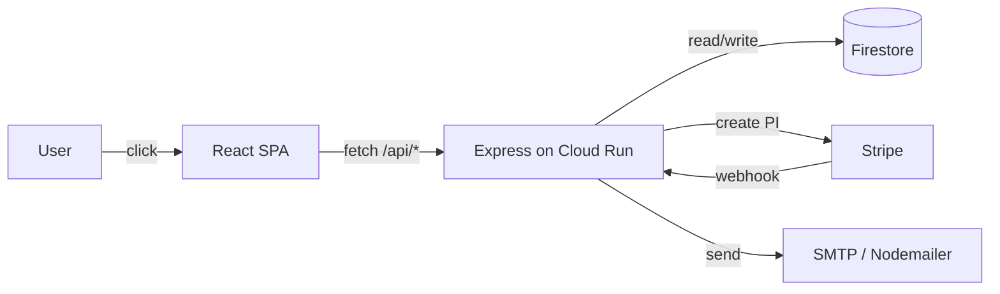

# User flows

> Authoritative trace of every live customer & admin flow.
> Each section follows the same template: actors → trigger → steps →
> data touched → emails → failure modes → observability. Update when a
> flow's code changes; this doc is the contract between product and
> engineering.
>
> Updated 2026-05-12. Source of truth: code in `src/`, `server.js`, `api/`.

## How to read this doc

- **Actors** — who initiates and who consumes
- **Trigger** — what user action starts the flow
- **Steps** — numbered; cite file:line for the meaningful hops
- **Data touched** — Firestore collections written or read
- **Emails** — transactional sends + their templates
- **Failure modes** — known unhappy paths
- **Observability** — what shows up in Sentry / logs (post-Phase-1)



---

## 1. Discovery flight booking

**Actors** — prospective customer (buyer); HQ Aviation ops team (recipient of email + booking record).

**Trigger** — customer navigates to `/training/trial-lessons` (`src/App.jsx:214`), selects an aircraft and duration, clicks through to `/checkout`.

**Steps**

1. **Landing page** — `src/pages/DiscoveryFlight.jsx` renders the discovery-flight page at route `/training/trial-lessons` (`src/App.jsx:214`). Pricing is fetched client-side via `usePricing` hook; the hook reads from Firestore `pricing/discovery_{aircraft}_{dur}min` but the server re-validates price independently.

2. **Cart upsert** — `src/pages/Checkout.jsx` calls `upsertCart` (`src/lib/cart.js`) which writes to `POST /api/carts` (`server.js:424`). This persists the session-level cart for recovery purposes. The misc checkout path skips this step (`src/pages/Checkout.jsx:497`).

3. **Email collection** — The discovery-flight checkout form renders an inline email input (`src/pages/Checkout.jsx:153-162`). The collected email is included in the `upsertCart` payload so that a cart recovery email can be sent even if the user abandons before completing payment.

4. **Create PaymentIntent** — `src/pages/Checkout.jsx:82` posts to `POST /api/create-payment-intent` (`server.js:245`).
   - Server validates `aircraft` (r22/r44/r66), `duration` (30 or 60), `customerName`, `customerEmail`, `customerPhone` (`server.js:249-265`).
   - `api/stripe.js:280` calls `createPaymentIntent`:
     - Reads price from Firestore `pricing/discovery_{aircraft}_{dur}min`; falls back to `PRICE_FALLBACK` (`api/stripe.js:135-139`).
     - Prices any add-ons from `misc_items` (`api/stripe.js:81-130`).
     - Generates a unique `referralCode` and writes it to `referral_codes/{code}` (`api/stripe.js:332-374`).
     - Validates any incoming `referredByCode` against `referral_codes` + checks owner Stripe PI is not refunded (`api/stripe.js:216-247`).
     - Creates Stripe PaymentIntent with all booking fields in `metadata` (`api/stripe.js:336-361`).
   - Returns `{ clientSecret }` to the SPA.

5. **Card confirmation** — `src/pages/Checkout.jsx:113` calls `stripe.confirmCardPayment(clientSecret, { payment_method: { card: ... } })` via Stripe.js.

6. **Client-side fire-and-forget** — On success the SPA posts `paymentIntentId` to `POST /api/record-booking` (`server.js:371`, `src/pages/Checkout.jsx:125`). This is idempotent — it writes/merges the booking document to Firestore `bookings/{pi.id}` (`api/stripe.js:1044-1145`). The webhook (Flow 9) is the canonical path; `record-booking` is the fallback.

7. **Navigate to confirmation** — SPA navigates to `/booking-confirmed?ref={pi.id}&aircraft=...&duration=...` (`src/pages/Checkout.jsx:130-134`).

8. **Confirmation page** — `src/pages/BookingConfirmed.jsx` fires a client-side `purchase` analytics event (`src/pages/BookingConfirmed.jsx:54`), then fetches `GET /api/booking/{pi.id}` to display the booking summary (`src/pages/BookingConfirmed.jsx:71`). For non-misc bookings, renders `<PostCheckoutOffers>` (`src/pages/BookingConfirmed.jsx:153`) which conditionally displays a referral CTA or upgrade offer based on the booking data.

9. **Stripe webhook** — Stripe delivers `payment_intent.succeeded` to `POST /api/webhook` (see Flow 9). The webhook handler writes the canonical `bookings` document and sends the confirmation email (`api/stripe.js:1000-1033`).

**Data touched**

| Collection | Operation | Key |
|---|---|---|
| `carts` | write (upsert) | `sessionId` |
| `pricing` | read | `discovery_{aircraft}_{dur}min` |
| `misc_items` | read | add-on `itemId` |
| `referral_codes` | write (new code) + read (validate incoming) | `{code}` |
| `bookings` | write | `{pi.id}` |
| `page_events` | write (purchase event) | auto-id |

**Emails**

- `sendConfirmationEmail` in `api/stripe.js:441` — subject: `Discovery Flight Confirmed — {aircraftName} · HQ Aviation`. Inline HTML template with booking summary, optional add-ons block, referral CTA, and "What Happens Next" sidebar.

**Failure modes**

- Invalid aircraft/duration → `server.js:255-257` returns HTTP 400 before Stripe is called.
- Stripe card decline → `stripe.confirmCardPayment` returns `result.error`; SPA shows the Stripe-supplied decline message (`src/pages/Checkout.jsx:122-123`).
- `record-booking` fails → non-fatal; webhook still writes the booking.
- Confirmation email fails → logged `[stripe webhook] confirmation email failed:`; booking is already persisted (`api/stripe.js:1031`).
- Firestore price lookup fails → fallback to `PRICE_FALLBACK` constants (`api/stripe.js:268-273`).

**Observability**

- `[cart-recovery]` prefix in server logs for cart lifecycle.
- `[stripe webhook]` prefix for all webhook processing errors.
- `page_events` collection stores purchase events keyed on `transactionId` for deduplication.

---

## 2. London tour booking

**Actors** — prospective customer; HQ Aviation ops team.

**Trigger** — customer navigates to `/helicopter-tour-of-london` (`src/App.jsx:254`), selects experience (shared/private), time of day (day/sunset/night), quantity, and clicks "Book" which navigates to `/london-tour-checkout` (`src/App.jsx:217`).

**Steps**

1. **Landing page** — `src/pages/HelicopterTourOfLondon.jsx` is the marketing page; the checkout is a dedicated route at `/london-tour-checkout` rendered by `src/pages/LondonTourCheckout.jsx`.

2. **Create PaymentIntent** — `src/pages/LondonTourCheckout.jsx:55` posts to `POST /api/create-london-tour-payment-intent` (`server.js:291`).
   - Server validates `experience` (shared/private), `timeOfDay` (day/sunset/night), `quantity` (1-4), `customerName`, `customerEmail`, `customerPhone` (`server.js:294-309`).
   - `api/stripe.js:385` calls `getLondonTourPrice`: reads from Firestore `pricing/london_tour_{experience}_{timeOfDay}`; falls back to `LONDON_TOUR_BASE_PRICES` constants (`api/stripe.js:143-146`). For shared tours price = `basePrice × quantity`; for private, price is the flat charter fee.
   - `api/stripe.js:418` creates the Stripe PaymentIntent with `productType: 'london-tour'` in metadata.
   - Returns `{ clientSecret }`.

3. **Card confirmation** — `src/pages/LondonTourCheckout.jsx:79` calls `stripe.confirmCardPayment`.

4. **Client-side fire-and-forget** — On success posts to `POST /api/record-booking` (`src/pages/LondonTourCheckout.jsx:91`).

5. **Navigate to confirmation** — SPA navigates to `/london-tour-confirmed?ref={pi.id}&experience=...` (`src/pages/LondonTourCheckout.jsx:97-99`). `src/pages/LondonTourConfirmed.jsx` renders the confirmation page.

6. **Stripe webhook** — `payment_intent.succeeded` with `productType === 'london-tour'` triggers `sendLondonTourConfirmationEmail` (`api/stripe.js:1001-1011`) and writes to `bookings/{pi.id}` with `experience`, `timeOfDay`, `quantity` fields (`api/stripe.js:829-833`).

**Data touched**

| Collection | Operation | Key |
|---|---|---|
| `pricing` | read | `london_tour_{experience}_{timeOfDay}` |
| `bookings` | write | `{pi.id}` |
| `page_events` | write | auto-id |

**Emails**

- `sendLondonTourConfirmationEmail` in `api/stripe.js:617` — subject: `London Tour Confirmed — {experienceName} · HQ Aviation`. Booking summary with experience, time of day, passenger count, amount, reference.

**Failure modes**

- Invalid experience/timeOfDay/quantity → HTTP 400 from `server.js:297-306`.
- Stripe card decline → error message shown in `src/pages/LondonTourCheckout.jsx:88`.
- Same email/booking-persistence failure modes as Flow 1.

**Observability**

- Same `[stripe webhook]` log prefix. No separate cart-recovery path — London tour checkout does not use `POST /api/carts`.

---

## 3. Misc marketplace purchase

**Actors** — customer; HQ Aviation ops team (admin view + fulfilment).

**Trigger** — customer browses `/misc` (`src/App.jsx:228`), clicks an item to reach `/misc/:id` (`src/App.jsx:229`), clicks "Buy Now".

**Steps**

1. **Item detail page** — `src/pages/MiscItemDetail.jsx:240` reads `misc_items/{id}` from Firestore client-side. Displays images, description, price, stock.

2. **Size selection (apparel only)** — if `item.apparel === true && item.sizes.length > 0`, a size button group is rendered (`src/pages/MiscItemDetail.jsx:459-480`). State is held in `selectedSize` (`src/pages/MiscItemDetail.jsx:230`). The "Buy Now" button is disabled until a size is selected (`src/pages/MiscItemDetail.jsx:331`).

3. **Navigate to shared checkout** — `handleBuyNow` (`src/pages/MiscItemDetail.jsx:259`) navigates to `/checkout?type=misc&itemId={id}&itemName=...&price=...&qty=...&size=...`.

4. **Misc checkout form** — `src/pages/Checkout.jsx:258` renders `MiscCheckoutForm` when `type === 'misc'`. No cart upsert for misc items (`src/pages/Checkout.jsx:497`).

5. **Create PaymentIntent** — `src/pages/Checkout.jsx:280` posts to `POST /api/create-misc-payment-intent` (`server.js:334`).
   - Server validates `itemId`, `customerName`, `customerEmail`, `customerPhone`, `qty` (`server.js:337-348`).
   - `api/stripe.js:1152` calls `createMiscPaymentIntent`:
     - Reads `misc_items/{itemId}` from Firestore. Checks `priceType === 'fixed'` and `price > 0` (`api/stripe.js:1160`).
     - Validates stock if `item.hasQuantity === true` (`api/stripe.js:1172-1178`).
     - Validates shipping address if `item.requiresShipping === true` (`api/stripe.js:1184-1190`).
     - Validates size against `item.sizes` if `item.apparel === true` (`api/stripe.js:1193-1206`).
     - Creates Stripe PaymentIntent with `productType: 'misc'`, `itemId`, `itemName`, `qty`, `apparelSize` in metadata (`api/stripe.js:1210-1227`).

6. **Card confirmation** — `src/pages/Checkout.jsx:302` calls `stripe.confirmCardPayment`.

7. **Client-side fire-and-forget** — posts to `POST /api/record-booking` (`src/pages/Checkout.jsx:314`).

8. **Navigate to confirmation** — `/booking-confirmed?ref={pi.id}&type=misc&itemName=...` (`src/pages/Checkout.jsx:319-325`). `src/pages/BookingConfirmed.jsx` detects `type === 'misc'` (`src/pages/BookingConfirmed.jsx:25`) and renders the misc confirmation view.

9. **Stripe webhook** — on `payment_intent.succeeded` with `productType === 'misc'`:
   - Writes to `bookings/{pi.id}` with `itemId`, `itemName`, `qty`, optional `apparelSize` (`api/stripe.js:834-839`).
   - Writes a separate document to `misc_marketplace/{pi.id}` with `type: 'order'` (`api/stripe.js:871-888`). This is the collection the admin marketplace view reads.
   - No confirmation email is sent for misc orders (`api/stripe.js:1012-1013`); admin contacts customer directly.

**Data touched**

| Collection | Operation | Key |
|---|---|---|
| `misc_items` | read | `{itemId}` |
| `bookings` | write | `{pi.id}` |
| `misc_marketplace` | write (order) | `{pi.id}` |
| `page_events` | write | auto-id |

**Emails** — None to customer. Admin sees the order in `misc_marketplace` via `/admin/misc/orders` (`src/App.jsx:270`).

**Failure modes**

- Item not found → HTTP 400 (`api/stripe.js:1154-1157`).
- Out of stock → HTTP 400 (`api/stripe.js:1173-1175`).
- Size required but not sent → HTTP 400 (`api/stripe.js:1195-1198`).
- Item has `priceType !== 'fixed'` → HTTP 400 (`api/stripe.js:1160-1163`).

**Observability**

- `[stripe webhook]` log prefix for write failures.

---

## 4. Apparel purchase

**Actors** — customer; HQ Aviation ops team.

**Trigger** — customer visits `/misc/:id` for an item where `item.apparel === true`.

**Steps**

This flow is identical to Flow 3 (Misc marketplace purchase) with one additional step:

1–3. Same as Flow 3.

2a. **Size required** — `src/pages/MiscItemDetail.jsx:330-331` sets `isApparel = true` and `buyDisabled = isApparel && !selectedSize`. The "Buy Now" button's `disabled` state prevents proceeding without a size.

2b. **Size state** — `selectedSize` is stored in local state (`src/pages/MiscItemDetail.jsx:230`), reset when navigating to a different item (`src/pages/MiscItemDetail.jsx:239`). Available sizes come from `item.sizes` (an array of strings stored in Firestore `misc_items`).

2c. **Size in URL** — `handleBuyNow` includes `&size={selectedSize}` in the navigation URL (`src/pages/MiscItemDetail.jsx:267`).

4–9. Same as Flow 3. The `size` field is passed to `POST /api/create-misc-payment-intent` as `size` (`src/pages/Checkout.jsx:291`), validated against `item.sizes` server-side (`api/stripe.js:1193-1206`), stored as `apparelSize` in the Stripe PaymentIntent metadata, and persisted in both `bookings` and `misc_marketplace` documents (`api/stripe.js:839`, `api/stripe.js:884`).

**Data touched** — same as Flow 3.

**Emails** — None to customer (same as Flow 3).

**Failure modes**

- Size not provided → `MiscCheckoutForm` passes an empty `size`; server returns HTTP 400 `Size is required for this apparel item` (`api/stripe.js:1195-1198`).
- Invalid size value → HTTP 400 `Size {s} is not available` (`api/stripe.js:1200-1203`).

**Observability**

Same as Flow 3 (Misc marketplace purchase). The webhook handler does not differentiate apparel from non-apparel misc items in its logging; apparel size choices appear as `metadata.apparelSize` on the PaymentIntent and persist in the Firestore doc under `misc_marketplace/{id}`. Post-Phase-1, Sentry release tagging applies uniformly.

---

## 5. Parts enquiry

**Actors** — customer (parts buyer / MRO engineer); HQ parts team.

**Trigger** — customer browses `/parts` (`src/App.jsx:230`), `/parts/:id` (`src/App.jsx:234`), or `/maintenance` and opens the enquiry modal.

**Steps**

1. **Modal trigger** — `src/components/parts/EnquireModal.jsx` is rendered by parent pages. The `mode` prop can be `'enquire'` (stock listing), `'request'` (sourcing request), or `'general'` (no specific part).

2. **Form submission** — `src/components/parts/EnquireModal.jsx:28` handles submit. Posts to `POST /api/parts-enquiry` (`server.js:468`).

3. **Route delegation** — `server.js:468-474` uses a lazy-import wrapper because `api/parts-enquiry.js` is ESM (`import` syntax) while the rest of the server is CJS. The module is eagerly started at boot (`server.js:40-45`); the per-request handler waits for the import promise if it hasn't resolved yet.

4. **Server validation** — `api/parts-enquiry.js:75-119` validates:
   - `partNumber`, `name`, `email` required.
   - `qty` integer 1-999.
   - `condition` one of `VALID_CONDITIONS` (`new`, `used`, `overhauled`, `exchange`, `repaired`, `any`).
   - `kind` one of `VALID_KINDS` (`enquire`, `request`).
   - Rate limit: 5 requests per 10 minutes per IP (`api/parts-enquiry.js:15-22`).

5. **Firestore write** — `api/parts-enquiry.js:109` writes to `parts_enquiries` with `partNumber`, `partListingId`, `condition`, `qty`, `name`, `email`, `phone`, `tail`, `notes`, `kind`, `status: 'open'`.

6. **Ops email** — `api/parts-enquiry.js:112` calls `sendOpsEmail` (best-effort, fire-and-forget). Sends to `PARTS_ENQUIRY_EMAIL` or `EMAIL_FROM` (`api/parts-enquiry.js:47`). Subject: `[Parts Enquiry] {partNumber} — {condition} × {qty}` or `[Parts Sourcing Request] ...`. Plain-text body with all fields plus a direct admin URL.

7. **Success response** — Returns `{ id: ref.id }`. Modal shows success state (`src/components/parts/EnquireModal.jsx:93-101`).

**Data touched**

| Collection | Operation | Key |
|---|---|---|
| `parts_enquiries` | write | auto-id |

**Emails**

- Ops notification to `PARTS_ENQUIRY_EMAIL` (or `EMAIL_FROM` fallback) — plain-text, includes part number, condition, qty, customer contact details, direct admin link.

**Failure modes**

- Missing required fields → HTTP 400 (`api/parts-enquiry.js:79`).
- Rate limit exceeded → HTTP 429 (`api/parts-enquiry.js:15-22`).
- SMTP down → error logged `[parts-enquiry] email failed:`, enquiry is still saved to Firestore (`api/parts-enquiry.js:112`).
- ESM import failure → HTTP 500 `Parts enquiry module failed to load` (`server.js:471`).

**Observability**

- `[parts-enquiry]` log prefix for email failures.
- Admin view at `/admin/parts/enquiries` (`src/App.jsx:273`).

---

## 6. Contact / general lead capture

**Actors** — prospective customer; HQ sales / ops team.

**Trigger** — customer submits any inline lead-capture form on the site. There is no dedicated `/contact` route in `src/App.jsx`; the `POST /api/leads` endpoint is called from multiple page-level forms across the SPA.

**Steps**

1. **Form** — Multiple pages embed inline lead forms that post to `/api/leads`. Representative callers include:
   - `src/pages/Experimentation.jsx:3295` — trade-in / "we buy your aircraft" form on the home page.
   - `src/pages/TypeRating.jsx` — type-rating enquiry.
   - `src/pages/UsedAircraftDetail.jsx:580` — aircraft enquiry CTA on pre-owned listings.
   - `src/components/AircraftAlertSignup.jsx:136` — aircraft availability alert sign-up.
   - `src/pages/PartSales.jsx:30` — parts sales enquiry.
   - `src/pages/Testimonials.jsx:66` — testimonial submission.

2. **Request** — Forms POST `{ name, email, phone, subject, message, source }` to `POST /api/leads` (`server.js:409`).

3. **Server validation** — `api/leads.js:35` validates `name` and `email` are present. Rate limit: 5 requests per 10 minutes per IP (`api/leads.js:10-17`).

4. **Firestore write** — `api/leads.js:42` writes to `leads/` collection with `name`, `email`, `phone`, `subject`, `message`, `source`, `status: 'new'`, `notes: ''`.

5. **Response** — Returns `{ id: ref.id }`. Each form page handles its own success UI.

6. **Admin management** — Admins can update lead status (new/contacted/qualified/closed) and notes via `PATCH /api/leads/:id` (`api/leads.js:63`). Admin view at `/admin/leads` (`src/App.jsx:280`).

**Data touched**

| Collection | Operation | Key |
|---|---|---|
| `leads` | write | auto-id |

**Emails** — None sent automatically. HQ team works the `leads` collection in the admin panel and contacts customers manually.

**Failure modes**

- Missing `name` or `email` → HTTP 400 (`api/leads.js:38-40`).
- Rate limit exceeded → HTTP 429 (`api/leads.js:10-17`).
- Firestore error → HTTP 500 (`api/leads.js:57-58`).

**Observability**

- `Lead capture error:` log prefix on failures.

---

## 7. Cart recovery

**Actors** — Cloud Run cron (automated); customer (email recipient); admin (optional manual trigger).

**Trigger** — cron fires every 15 minutes when `CART_RECOVERY_AUTO=true` (`server.js:567-576`).

**Steps**

1. **Cron schedule** — `server.js:572` schedules `*/15 * * * *` with `node-cron`. On each tick calls `runRecoveryTick(new Date())` from `api/cart-recovery-runner.js:12`.

2. **Fetch carts** — `api/cart-recovery-runner.js:17-27` queries `carts` collection for documents with `status in ['active', 'abandoned', 'completed', 'expired']`, limit 500.

3. **Compute actions** — `api/lib/cartRecoveryActions.js:46` (`computeRecoveryActions`) applies deterministic rules per cart:
   - `active` + idle ≥ 1 hour → `mark_abandoned` (`api/lib/cartRecoveryActions.js:70-73`).
   - `abandoned` + age ≥ 7 days → `mark_expired` (`api/lib/cartRecoveryActions.js:64-67`).
   - `completed` or `expired` + age ≥ 90 days → `prune` (delete) (`api/lib/cartRecoveryActions.js:58-61`).
   - `abandoned` + contactable + no `1h` email sent → `send_1h` (`api/lib/cartRecoveryActions.js:80-84`).
   - `abandoned` + contactable + `1h` sent + ≥ 24 h since last email → `send_24h` (`api/lib/cartRecoveryActions.js:86-92`).
   - Send actions capped at 50 per tick (`api/lib/cartRecoveryActions.js:10`).

4. **Quiet hours** — `api/cart-recovery-runner.js:31` checks `isQuietHourLondon(now)`; if quiet, send actions are deferred (`api/cart-recovery-runner.js:52-55`).

5. **Apply actions** — `api/cart-recovery-runner.js:33-64`:
   - `mark_abandoned` / `mark_expired` / `prune` → Firestore writes or deletes.
   - `send_1h` / `send_24h` → calls `sendCartRecoveryEmail(cartId, type, 'cron')` in `api/lib/cartRecoverySend.js:14`.

6. **Send email** — `api/lib/cartRecoverySend.js`:
   - Reads `carts/{cartId}`.
   - Guards: no email on record, `noEmail === true`, `status === 'completed'`, or `excludedFromAnalytics` → throws, skips send (`api/lib/cartRecoverySend.js:24-27`).
   - Calls `renderCartRecoveryEmail(cart, siteUrl, type)` from `api/templates/cart-recovery.js`. For `1h` and `manual` types uses `render1hCartRecoveryEmail`; for `24h` uses `render24hCartRecoveryEmail` (`api/templates/cart-recovery.js:3`).
   - Sends via Nodemailer with RFC 8058 one-click unsubscribe headers pointing to `GET /api/carts/unsubscribe?t={recoveryToken}` and `POST /api/carts/unsubscribe` (`api/lib/cartRecoverySend.js:33-47`).
   - Appends audit entry to `recoveryEmailsSent[]` on the cart document, sets `status: 'abandoned'` if not already completed (`api/lib/cartRecoverySend.js:49-63`).

7. **Recovery link click** — customer clicks the "Complete your booking" link in the email. URL is `/checkout?t={recoveryToken}&utm_source=recovery`. `GET /api/carts/by-token` (`api/carts.js:160`) resolves the token to a cartId, marks the most-recent email entry `clicked: true`, and returns rehydration fields to the SPA.

8. **Unsubscribe** — `GET /api/carts/unsubscribe?t={token}` (`api/carts.js:284`) sets `noEmail: true` on the cart. `POST /api/carts/unsubscribe` provides the RFC 8058 one-click endpoint (`api/carts.js:265`).

9. **Pixel** — `GET /api/carts/email-pixel?t={token}&type={type}` (`api/carts.js:213`) returns a 1x1 transparent GIF and marks the matching `recoveryEmailsSent` entry as `opened: true`.

**Data touched**

| Collection | Operation | Key |
|---|---|---|
| `carts` | read + write (status, audit) | `{cartId}` |

**Emails**

- `api/templates/cart-recovery.js` — `1h` email: subject `Your HQ Aviation booking is saved`; inline HTML with aircraft, duration, price, resume link.
- `api/templates/cart-recovery-24h.js` — `24h` follow-up email.

**Failure modes**

- `CART_RECOVERY_AUTO` not set → cron does not register (`server.js:577`); no recovery emails.
- Cart has no email → skipped silently (`api/lib/cartRecoverySend.js:24`).
- `noEmail: true` → skipped silently (`api/lib/cartRecoverySend.js:25`).
- Admin email (`ADMIN_EMAIL` env var) excluded from analytics and recovery via `isAdminEmail` check (`api/carts.js:30-33`, `api/carts.js:124`).
- Send cap: max 50 emails per tick (`api/lib/cartRecoveryActions.js:5`).

**Observability**

- `[cart-recovery] tick {json}` log after each tick including `scanned`, `marked`, `sent`, `pruned`, `deferred_quiet`, `errors[]`.
- `[cart-recovery] {cartId} {action} failed:` per-cart error.

---

## 8. Admin auth + FAQ CRUD

**Actors** — HQ team member (admin role or super_admin role); Firebase Auth.

**Trigger** — admin navigates to `/admin/login` (`src/App.jsx:260`) and submits email + password.

### Authentication

1. **Login form** — `src/pages/admin/AdminLogin.jsx:19` calls `signInWithEmailAndPassword(auth, email, password)` (Firebase Auth SDK).

2. **Token fetch** — On success, `src/pages/admin/AdminLogin.jsx:24` calls `getIdTokenResult(true)` to force-refresh and log the custom claims, then navigates to `/admin` (`src/pages/admin/AdminLogin.jsx:26`).

3. **Route guard** — All admin routes are wrapped in `<AdminRoute>` (`src/App.jsx:261-286`). `src/components/admin/AdminRoute.jsx:4` calls `useAdmin()` hook (`src/hooks/useAdmin.js:5`). The hook subscribes to `onAuthStateChanged` and calls `getIdTokenResult(firebaseUser, true)` to read the `role` custom claim (`src/hooks/useAdmin.js:25-29`). If `role !== 'admin' && role !== 'super_admin'`, redirects to `/admin/login` (`src/components/admin/AdminRoute.jsx:18-20`).

### FAQ CRUD (representative admin data flow)

4. **List / read FAQs** — Admin page `src/pages/admin/AdminFaqs.jsx` reads from Firestore `faqs` collection (client-side SDK, bypasses API).

5. **Create FAQ** — `POST /api/admin/faqs` (`server.js:451`). Handler `api/admin-faqs.js:31` calls `requireAdmin` (`api/admin-faqs.js:9`) which verifies the Firebase ID token and checks `role === 'admin' || role === 'super_admin'`. Writes to Firestore `faqs` collection with `{ page, question, answer, displayOrder, visible }` (`api/admin-faqs.js:37-44`).

6. **Update FAQ / reorder** — `PATCH /api/admin/faqs/:id` (`api/admin-faqs.js:56`). If `displayOrder` is in the body, uses a Firestore batch to shift sibling FAQs on the same page and place the moved FAQ at its target position (`api/admin-faqs.js:88-105`). Otherwise updates `question`, `answer`, `visible` fields.

7. **Delete FAQ** — `DELETE /api/admin/faqs/:id` (`api/admin-faqs.js:113`). Deletes the document then decrements `displayOrder` on all same-page FAQs with a higher order, keeping the sequence contiguous (`api/admin-faqs.js:122-133`).

**Other admin surfaces (one-line refs)**

| Admin route | API route | File |
|---|---|---|
| `/admin/sfh-partners` | `POST/PATCH/DELETE /api/admin/sfh-partners` | `api/admin-sfh-partners.js` |
| `/admin/sfh-events` | `POST/PATCH/DELETE /api/admin/sfh-events` | `api/admin-sfh-events.js` |
| `/admin/bookings` | Reads Firestore `bookings` directly | `src/pages/admin/AdminBookings.jsx` |
| `/admin/leads` | `PATCH /api/leads/:id` for status/notes | `api/leads.js:63` |
| `/admin/misc` | CRUD on `misc_items` | `src/pages/admin/AdminMiscItems.jsx` |
| `/admin/misc/orders` | Reads `misc_marketplace` | `src/pages/admin/AdminMiscMarketplace.jsx` |
| `/admin/parts/enquiries` | `PATCH /api/parts-enquiry/:id` | `api/parts-enquiry.js:122` |
| `/admin/pricing` | Reads/writes `pricing` | `src/pages/admin/AdminPricing.jsx` |
| `/admin/analytics` | `GET /api/gsc/daily` | `api/gsc-api.js:30` |

**Data touched**

| Collection | Operation | Key |
|---|---|---|
| `faqs` | read / write / delete | `{docId}` |

**Emails** — None.

**Failure modes**

- Missing or invalid Firebase ID token → HTTP 401 (`api/admin-faqs.js:12`).
- Valid token but wrong role → HTTP 403 (`api/admin-faqs.js:15-16`).
- FAQ not found on PATCH/DELETE → HTTP 404 (`api/admin-faqs.js:83`, `api/admin-faqs.js:118`).

**Observability**

- Firebase Auth audit logs (Google Cloud project).

---

## 9. Stripe webhook ingestion (transverse)

**Actors** — Stripe (sender); Express server on Cloud Run (receiver).

**Trigger** — Stripe delivers a `payment_intent.succeeded` (or any other) event to the registered webhook endpoint after a payment completes.

**Steps**

1. **Endpoint** — `POST /api/webhook` registered in `server.js:390`. Uses `express.raw({ type: 'application/json' })` middleware — this is critical; the raw body buffer is required for signature verification (`server.js:389`).

2. **Handler** — `server.js:391` calls `handleWebhook(req)` from `api/stripe.js:794`.

3. **Signature verification** — `api/stripe.js:801-807`:
   ```
   const sig = req.headers['stripe-signature'];
   const event = getStripe().webhooks.constructEvent(req.body, sig, process.env.STRIPE_WEBHOOK_SECRET);
   ```
   Throws `400` if signature is invalid or body has been parsed as JSON (common misconfiguration).

4. **Event routing** — `api/stripe.js:809` switches on `event.type`. Only `payment_intent.succeeded` is fully handled; all other types are logged and ignored (`api/stripe.js:1034-1036`).

5. **On `payment_intent.succeeded`** — the handler extracts `pi.metadata.productType` and branches:
   - `'london-tour'` — writes `bookings/{pi.id}` with tour fields; sends `sendLondonTourConfirmationEmail` (`api/stripe.js:829-833`, `api/stripe.js:1001-1011`).
   - `'misc'` — writes `bookings/{pi.id}` with item fields; writes `misc_marketplace/{pi.id}` with order details; no email sent (`api/stripe.js:834-888`).
   - default (`'discovery-flight'`) — writes `bookings/{pi.id}` with flight fields, referral code, add-ons, shipping; sends `sendConfirmationEmail`; processes referral redemption if `referredByCode` is set (`api/stripe.js:841-866`, `api/stripe.js:891-916`, `api/stripe.js:1014-1033`).

6. **Purchase event** — For all product types, `recordPurchaseEvent` writes a `purchase` event to `page_events` keyed on `transactionId: pi.id` with deduplication (`api/stripe.js:42-74`, `api/stripe.js:966-978`).

7. **Cart promotion** — If `pi.metadata.cartId` is set, the matching `carts/{cartId}` document is updated to `status: 'completed'` (`api/stripe.js:981-997`).

8. **Response** — `server.js:393` returns `{ received: true }`. Any unhandled exception returns HTTP 400 `{ error: 'Webhook processing failed' }` — never exposes internal detail to Stripe (`server.js:396-398`).

**Data touched**

| Collection | Operation | Key |
|---|---|---|
| `bookings` | write | `{pi.id}` |
| `misc_marketplace` | write (misc only) | `{pi.id}` |
| `carts` | write (status promotion) | `{cartId}` |
| `referral_codes` | read + write (referral redemption) | `{code}` |
| `page_events` | write | auto-id |

**Emails**

- Discovery flight: `sendConfirmationEmail` (`api/stripe.js:441`).
- London tour: `sendLondonTourConfirmationEmail` (`api/stripe.js:617`).
- Referral redeemed: `sendReferralRedeemedEmail` to `HQ_TEAM_EMAIL` (`api/stripe.js:764`).
- Misc: no email.

**Failure modes**

- `express.json()` applied instead of `express.raw()` to this route → `constructEvent` throws immediately with a body-parsing error.
- `STRIPE_WEBHOOK_SECRET` mismatch → `constructEvent` throws; 400 returned to Stripe; Stripe retries.
- Firestore write failure → logged; Stripe gets 200 (not 400) to prevent retries for partial successes once the booking is confirmed. Exception: the top-level `handleWebhook` wraps the entire handler in a try/catch at `server.js:391-398`; any uncaught throw returns 400 and triggers a Stripe retry.
- Email failure → caught and logged internally; does not cause the webhook to return 400 (`api/stripe.js:1031`).

**Observability**

- `[stripe webhook]` log prefix for all sub-errors.
- `Webhook error:` logged at the `server.js` level for top-level throws.

---

## 10. GSC sync (background)

**Actors** — Cloud Run cron (automated); Google Search Console API; Firestore.

**Trigger** — cron fires daily at 03:00 Europe/London when `GSC_SYNC_AUTO=true` (`server.js:584-596`).

**Steps**

1. **Cron schedule** — `server.js:589` schedules `0 3 * * *` (daily) with `node-cron` and `timezone: 'Europe/London'`. Calls `runGscSync({})` from `api/gsc-sync.js:27`.

2. **Date range** — `api/gsc-sync.js:39-40` sets `endDate = today − 2 days` (GSC data lags 2-3 days) and `startDate = endDate − 90 days` (default).

3. **Fetch from GSC API** — `api/gsc-sync.js:51` calls `gscQuery(...)` from `api/lib/gscClient.js`. The client is lazy-initialised using `GSC_SERVICE_ACCOUNT_JSON` env var (base64-encoded or raw JSON) with `webmasters.readonly` scope (`api/lib/gscClient.js:14-48`). Paginates in chunks of 25,000 rows via `startRow` until an incomplete page is returned.

4. **Transform rows** — Each row is transformed via `gscRowToDocId` and `gscRowToDoc` from `api/lib/gscTransforms.js` to produce a stable doc ID (date + query + page hash) and a clean document shape.

5. **Firestore batch writes** — `api/gsc-sync.js:61-79` writes in batches of 400 (below Firestore's 500-operation batch limit) to `gsc_daily/{docId}`. Uses `batch.set(...)` — idempotent on re-run.

6. **Admin read** — `GET /api/gsc/daily?days=30` (`api/gsc-api.js:30`, `server.js:439`) serves the `gsc_daily` data to the admin analytics panel. Protected by `requireAdmin` (`api/gsc-api.js:8-21`). Returns up to 20,000 rows ordered by `date desc`, `clicks desc` (`api/gsc-api.js:34-41`).

7. **Completion log** — `api/gsc-sync.js:88` logs `[gsc-sync] { rowsFetched, rowsWritten, errors, startDate, endDate, durationMs }`.

**Data touched**

| Collection | Operation | Key |
|---|---|---|
| `gsc_daily` | write (idempotent) | `{date}_{query}_{page}` hash |

**Emails** — None.

**Failure modes**

- `GSC_SYNC_AUTO` not set → cron does not register (`server.js:594-596`); no sync.
- `GSC_SERVICE_ACCOUNT_JSON` not set → `gscQuery` throws `GSC_SERVICE_ACCOUNT_JSON env var is not set`; logged, sync aborts (`api/gsc-sync.js:31-35`).
- `GSC_SITE_URL` not set → sync aborts with `GSC_SITE_URL not configured` error in log (`api/gsc-sync.js:31-35`).
- GSC API error mid-pagination → partial sync; errors appended to `log.errors[]`; sync proceeds to next page.
- Firestore batch failure → individual batch errors logged; remaining batches continue.

**Observability**

- `[gsc-sync] {json}` log after each run with full metrics.
- `[gsc-sync] tick threw:` at the `server.js` level for unexpected top-level throws.

---

## Appendix: flows known to be in flight or unbuilt

Captured here so the doc is honest about what *isn't* live.

- **Aircraft buyer enquiry / quote CTA** — no dedicated flow. `src/pages/AircraftR22.jsx`, `src/pages/AircraftR44.jsx`, etc. show read-only specs and gallery; the only path to enquire is a page-embedded form that posts to `/api/leads` with a `source` field identifying the aircraft page. There is no aircraft-specific API endpoint or quote system.

- **R22 → R44 upsell (Plan C)** — on `feat/plan-c-r22-r44-upgrade` (unmerged). Firestore fields `flightAmountPence` and `totalAmountPence` are written to `bookings` in anticipation of this feature (`api/stripe.js:863-865`, `api/stripe.js:1104-1107`). Document once merged.

- **Blog post CRUD** — admin surface at `/admin/blog/:id` exists in the route table (`src/App.jsx:276`). Backend is not documented here as it was not part of the discovery commands and warrants a separate investigation.

- **Referral redemption (customer-facing)** — the referral mechanism is backend-complete (referral code in confirmation email, `validateReferredByCode` on PI creation, `sendReferralRedeemedEmail` to HQ team), but there is no customer-facing redemption dashboard or status page. Tracked as a post-Phase-1 feature.

- **Self-fly hire booking** — `src/pages/SelfFlyHire.jsx` exists at `/self-fly-hire` (`src/App.jsx:227`), but the page embeds an inline form posting to `/api/leads`. No dedicated payment or availability flow exists.
